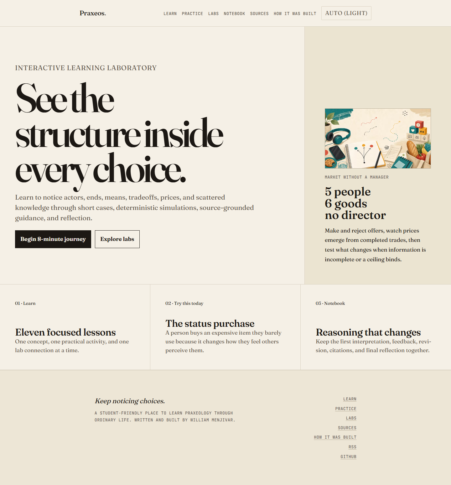

# Praxeos

> See the structure inside every choice.

[Praxeos](https://praxeos.vercel.app) is an interactive learning laboratory for
understanding human choices and economic systems through cases, deterministic
simulations, source-grounded Claude guidance, and reflection.

**Educational validation is pending.** The software is a verified portfolio
candidate; it is not v1.0 until five real learners complete the study and at
least one evidence-based revision is documented.



## Start with the flagship

[The Calculation Labyrinth](https://praxeos.vercel.app/journey/calculation-labyrinth)
is a seven-stage, 7–10 minute journey. A student team plans a school event with
a $1,200 budget and 20 volunteer-hours, interprets the choice, runs the same
labyrinth with and without price markers, compares the results, revises its
reasoning, and saves a final reflection.

The journey:

- persists locally through refreshes;
- never puts learner writing in a share URL;
- gives transparent, deterministic feedback without scores or a model answer;
- offers one optional, cited Socratic question from Claude;
- falls back completely when no API key or network is available; and
- exports Markdown, a print-ready record, and an SVG reflection card.

## Learning system

- **Learn** — eleven focused lessons, each with one concept, activity, lab link,
  progress, and resume state.
- **Practice** — a UTC-date-rotated everyday case for applying actor, end, means,
  constraint, tradeoff, and opportunity cost.
- **Labs** — four deterministic explorations with guided entry, exploration
  mode, readable change summaries, source links, reflection, shareable
  non-sensitive state, and non-canvas equivalents.
- **Notebook** — initial reasoning, rubric feedback, optional Guide turn,
  revisions, citations, lab state, and completion dates in one local-first
  learning record.
- **Sources** — glossary, thinker profiles, allowlisted primary-source packets,
  and the project’s teaching position.
- **How It Was Built** — the decisions, abandoned approaches, architecture,
  mistakes, verification, and study gate behind the work.

The product map is available in the editable
[Praxeos Product Map](https://www.figma.com/design/ZiEe4IeEPtGfkMeXLwE1Zk)
and as a repository-owned [board specification](./docs/product/figma-board-spec.md).

## What is original here

Praxeos does not treat a simulation result as proof that a learner understands
an idea. Interaction, interpretation, deterministic critique, revision, and
reflection are stored together. The same lab state can support more than one
defensible interpretation, while field-specific rules still identify missing
scenario evidence or a concept mismatch.

## Responsible AI

Claude is optional and server-only. `POST /api/guide` sends only the current
reasoning, normalized lab state, and allowlisted source packets. The adapter
uses Claude Sonnet 5 native citations, validates that factual explanation blocks
are cited, and accepts exactly one question. Invalid or unavailable responses
become deterministic guidance.

Learner text is treated as untrusted data, capped in size, intentionally not
logged, and never written to Redis. Rate-limit keys use hashed network
identifiers; Redis receives no learner text. Upstash limits are six requests per
minute and thirty per day. No account, transcript database, or permanent AI
history is required.

## Accessibility and privacy

The flagship uses semantic 2D controls with keyboard operation, large touch
targets, live status text, print styles, and a complete reduced-motion path.
Advanced labs retain their tasks and readable state when canvas rendering is
unavailable. The local-first store stays in the browser and can be cleared by
the learner. User-study records require explicit consent and are anonymized.

## Architecture

- Next.js 16.2.10, React 19, TypeScript, MDX, Tailwind CSS 4
- Three.js and React Three Fiber for advanced lab rendering
- versioned local-first browser store with migration from legacy progress
- pure TypeScript rubric, lab serialization, exports, and Guide validation
- Anthropic SDK behind a provider-neutral server interface
- optional Upstash Redis rate limits
- Vitest, Playwright, Biome, ESLint accessibility rules, link checks, and
  Lighthouse CI

```text
src/app/          routes, metadata, and the Guide endpoint
src/components/   journey, Notebook, layout, and reusable learning UI
src/lib/          rubric, local store, Guide providers, citations, exports
src/modules/      four deterministic advanced labs
src/content/      lessons and thinker source material
tests/            unit, Guide evaluation, cross-browser, and visual coverage
docs/             audit evidence, product map, study protocol, build report
```

## Local development

Node 22 and npm 10.9.3 are pinned.

```bash
npm ci
npm run dev
```

Copy `.env.example` to `.env.local` only when optional live Guide or Upstash
testing is needed. Never commit the resulting file.

```bash
npm run lint
npm run lint:a11y
npm run typecheck
npm test
npm run eval:guide
npm run build
npm run test:e2e
npm run check:links
npm run lighthouse:desktop
npm run lighthouse:mobile
```

Live Guide evaluation remains opt-in so normal verification never spends API
credits or depends on a provider key.

## Verification and roadmap

Actual results, failures, and open blockers are maintained in
[the build report](./docs/BUILD_REPORT.md). The five-person protocol and
anonymized results template are in [the study plan](./docs/USER_STUDY.md).

The credible path to v1.0 is deliberately short:

1. verify the Vercel preview with and without AI;
2. run the journey with five consented learners;
3. document at least one revision caused by observed evidence;
4. rerun every automated and manual check;
5. only then mark the PR ready, merge, verify production, and release v1.0.0.

No accounts, payments, social layer, large backend, or permanent AI transcript
storage are planned for this release.

## Authorship and collaboration

Praxeos was conceived, directed, written, and product-decided by William
Menjivar. Claude and Codex assisted with implementation, evaluation fixtures,
documentation, and verification under William’s requirements. AI-generated
feedback is visibly optional and never presented as educational validation.

## License

- Code: [MIT](./LICENSE)
- Original learning content: [CC BY 4.0](./LICENSE-CONTENT.md)
- Third-party source texts and cited materials retain their own licenses.
